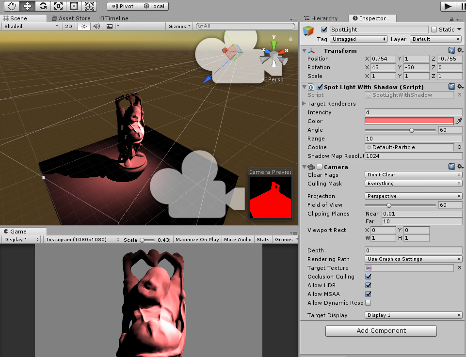
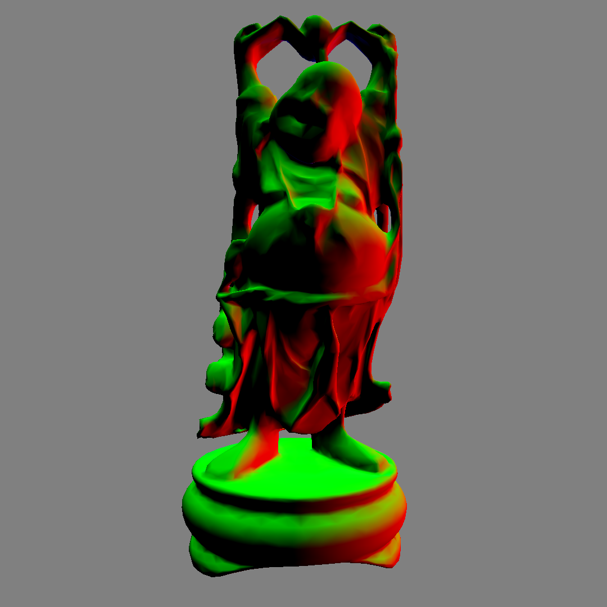
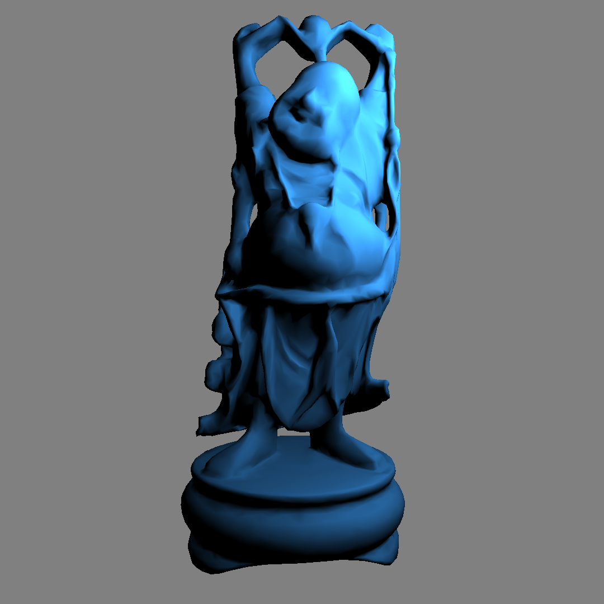
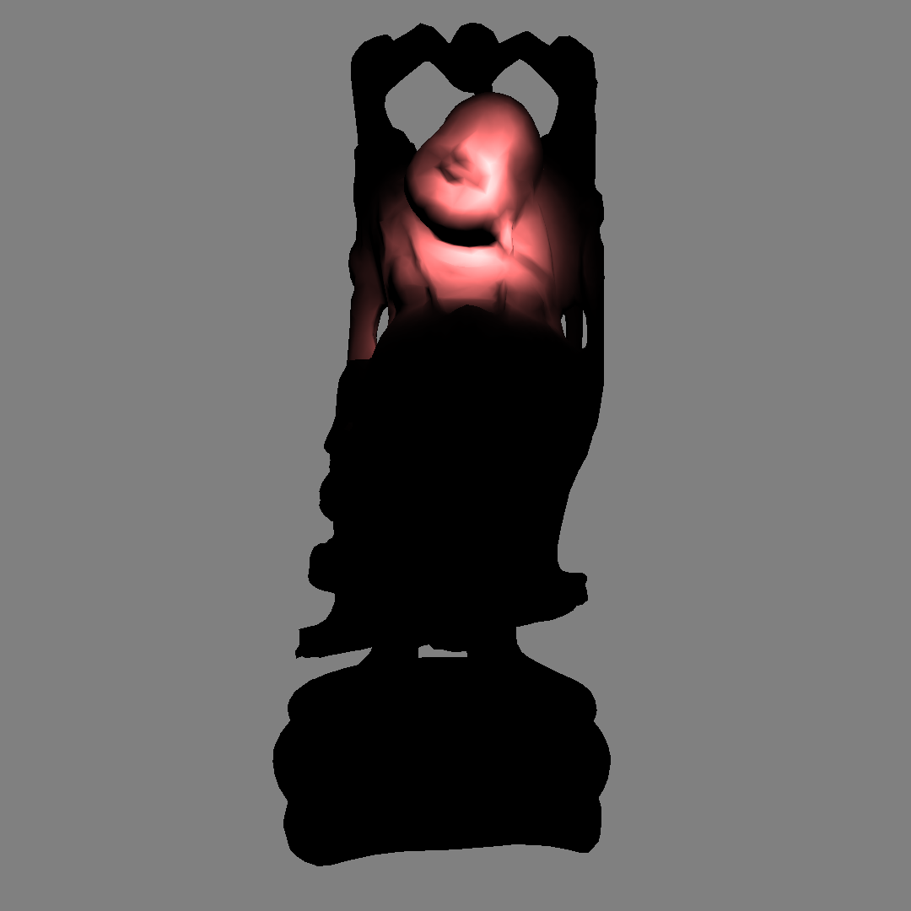
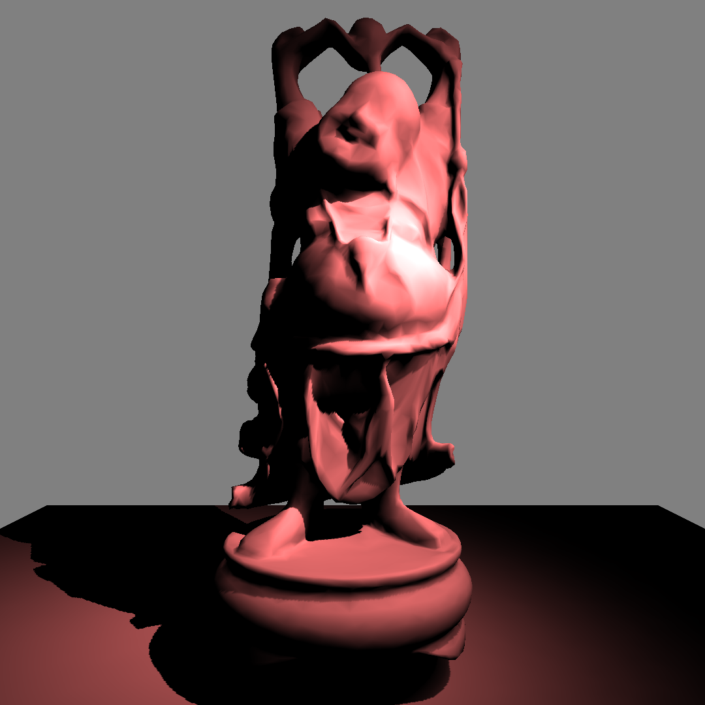
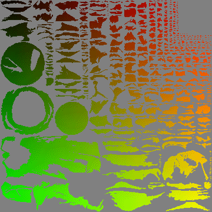

# Unity-SpotDrawing

visualize lighting and shadow without Unity's built-in light.

## 01 view normal

## 02 point light

## 03 spot light

## 04 spot light with shadow

## 05 view uv2

## 06 spot drawing

## model

[Happy Buddha(Stanford)](http://graphics.stanford.edu/data/3Dscanrep/)